# App 流程圖與架構圖

這份文件用 Mermaid 描述墨頁 Inkpage 目前 `main` 的整體架構與主要流程。圖中的節點只描述已存在的實作，不包含未接線的設計稿。

## 圖例

- `features/*`：頁面、feature provider、feature controller 與 UI orchestration。
- `core/services`：跨 feature 業務服務。
- `core/engine`：書源規則、JS、HTML/JSON/XPath/CSS/Regex parser 與 WebBook。
- `core/database`：Drift tables、DAO、SQLite。
- `SharedPreferences`：偏好設定與部分 reader setting。

## 總架構圖

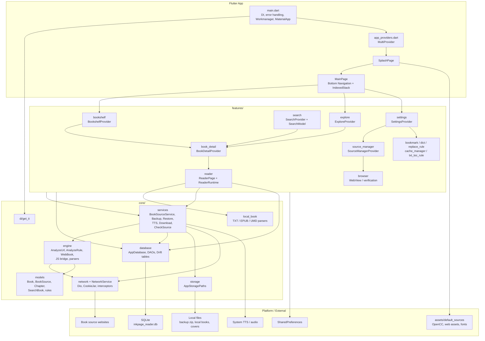

## 啟動流程

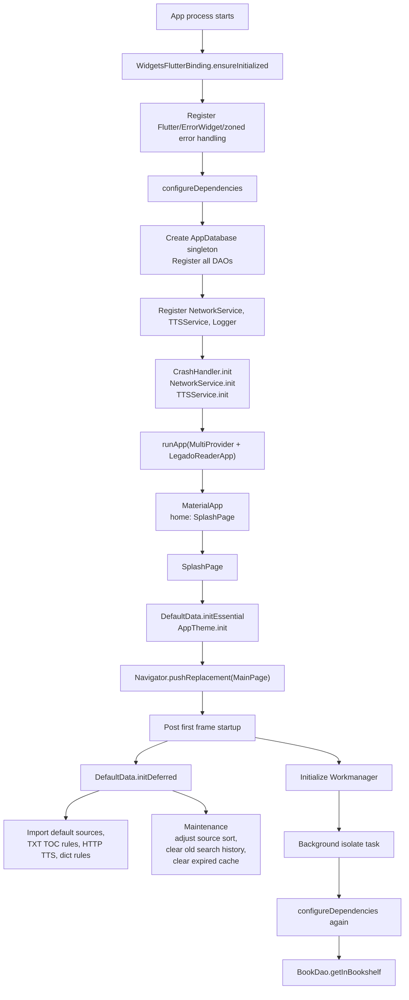

## 主導航與頁面流程

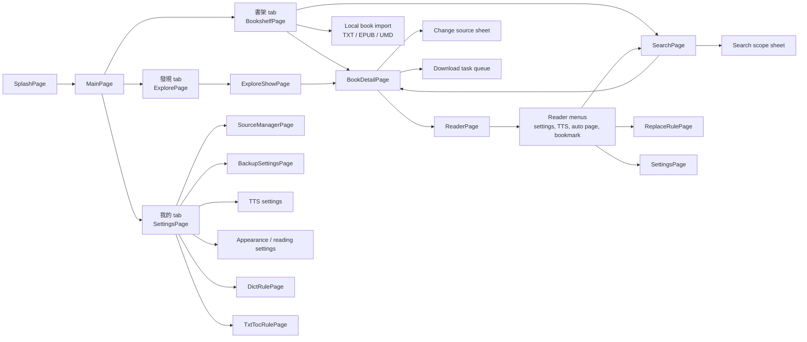

## 找書到閱讀流程

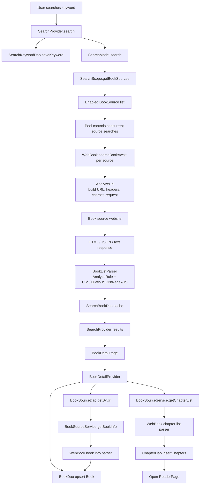

## 閱讀器架構與流程

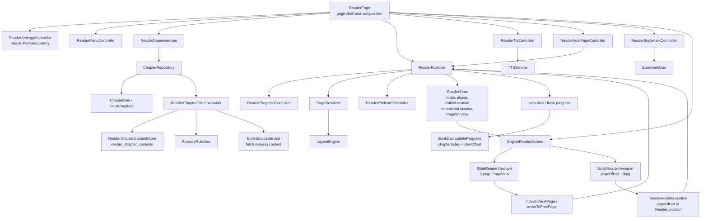

## 閱讀器位置與保存流程

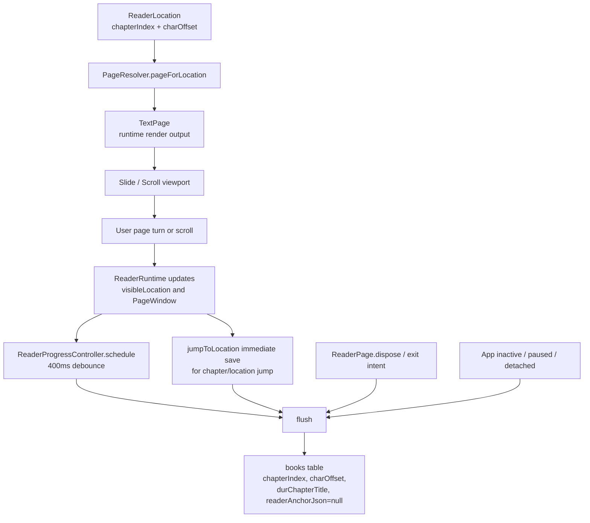

## 書源管理與檢查流程

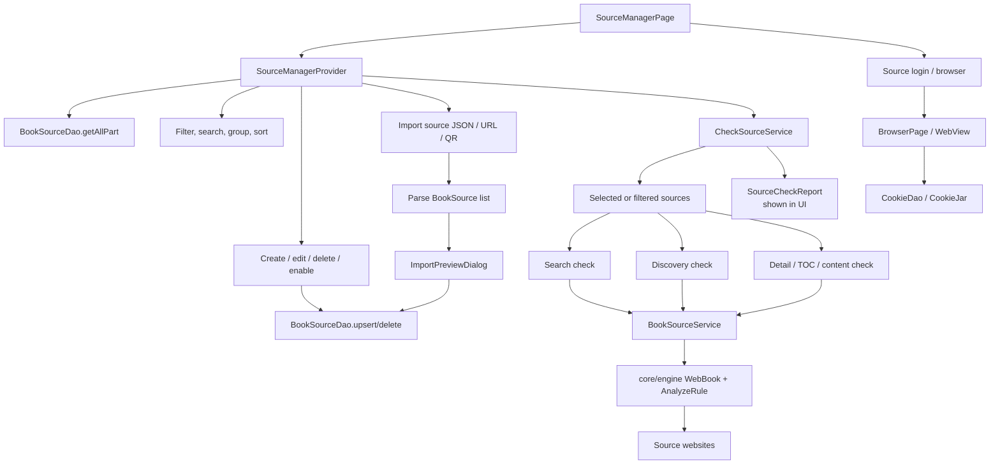

## 本地書流程

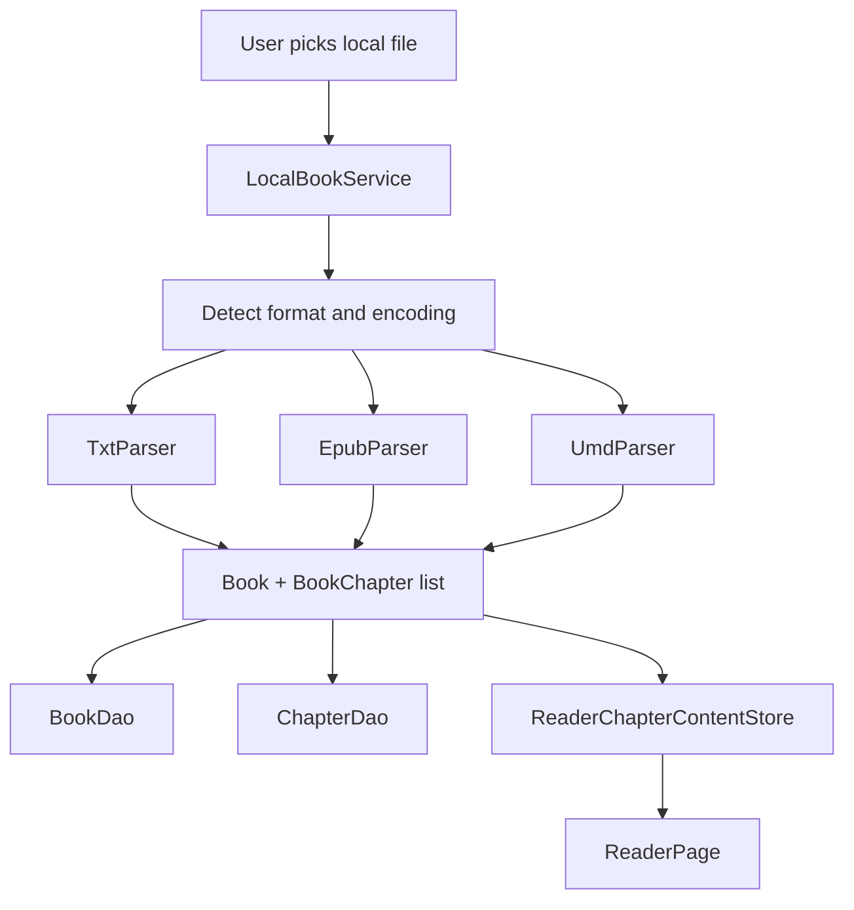

## 備份與還原流程

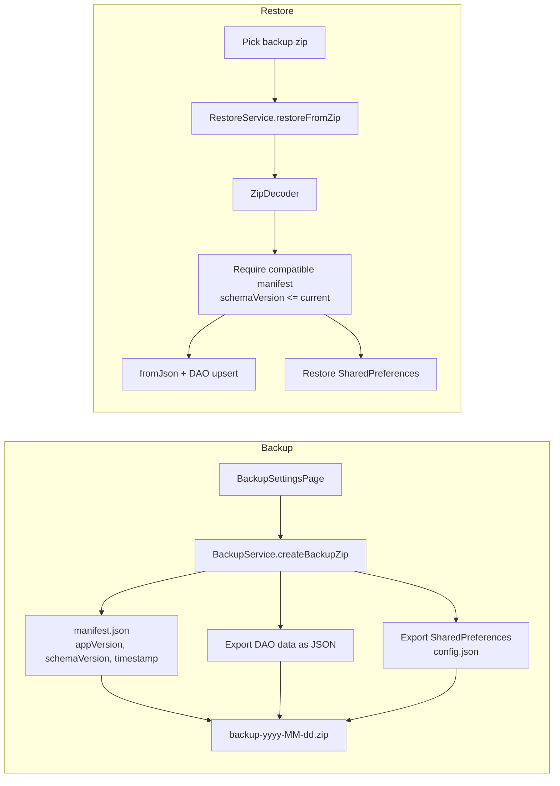

## 背景任務與下載流程

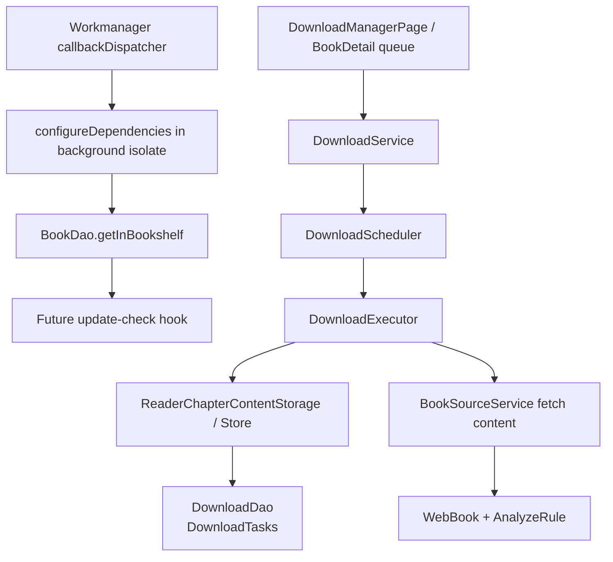

## 核心資料落點

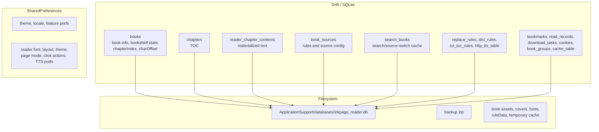

## 端到端主流程摘要

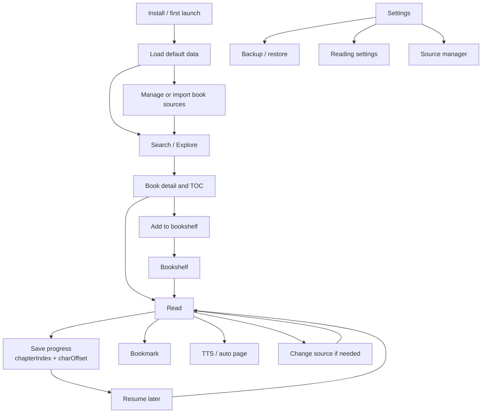
