# App 使用流程圖

這份文件只描述使用者從 app 入口開始會走到的產品流程。架構與資料層圖請看 [app_flow_architecture.md](app_flow_architecture.md)。

## A. 啟動與主入口

### A1 + A2. 打開 app、初始化、進入主頁

這張圖把使用者看到的流程與系統背後的初始化合在同一張圖。使用者只會看到 Splash 與主頁；系統會在同一段時間完成 DI、Provider、預設資料與啟動後維護。

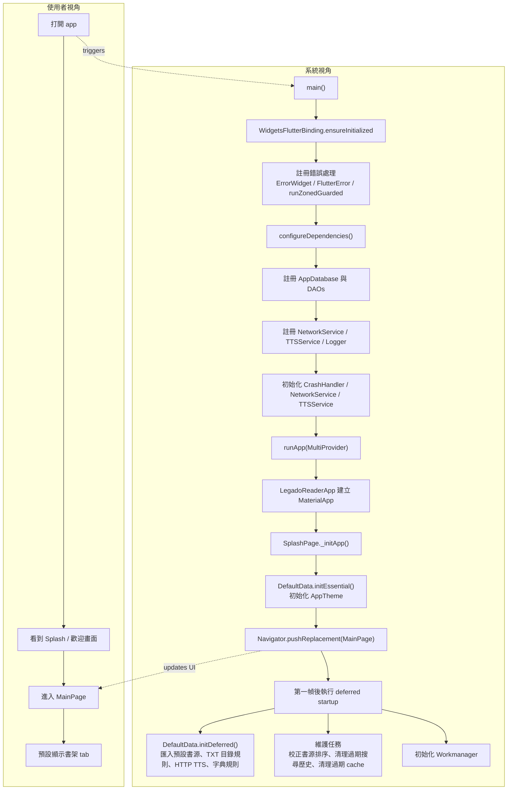

### A3. 底部 tab 切換

`MainPage` 使用 `NavigationBar` 與 `IndexedStack` 保留各 tab 狀態。預設進入書架；主頁固定提供書架、發現、我的三個 tab。

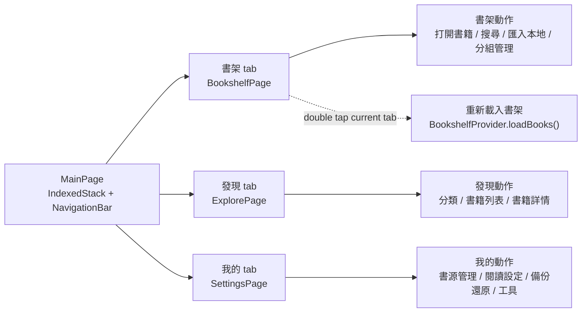

## A 類流程摘要

| 編號 | 使用者動作 | 使用者看到 | 系統主要動作 |
| --- | --- | --- | --- |
| A1 | 打開 app | Splash，然後進入主頁 | 建立 `MaterialApp`，進入 `SplashPage` |
| A2 | 等待初始化完成 | 自動進入 `MainPage` | DI、Provider、DefaultData essential/deferred、Workmanager |
| A3 | 點底部 tab | 書架 / 發現 / 我的切換 | `NavigationBar` 改變 index，`IndexedStack` 保留 tab 狀態 |

## B. 書架

書架入口是 `BookshelfPage`。使用者可從書架直接開書、匯入本地書、從 URL 或檔案匯入書架、切換視圖、多選管理與管理分組。

### B1. 打開書架上的一本書

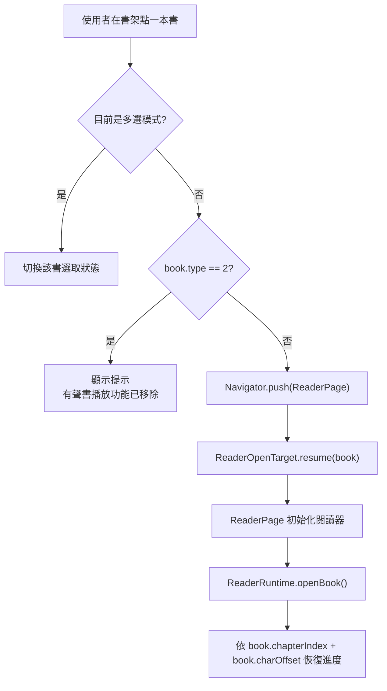

### B2. 匯入本地書 TXT / EPUB / UMD，再打開閱讀

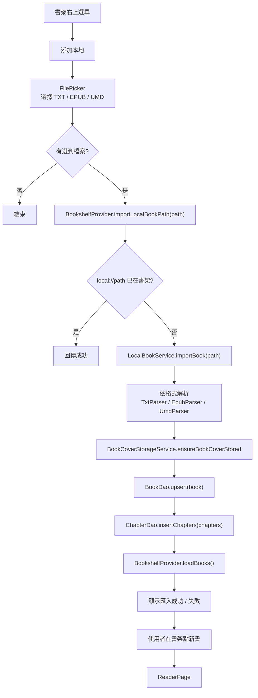

### B3. 添加網址

目前「添加網址」實作是從 URL 匯入書架資料，URL 內容需要是 Inkpage/相容格式的書架 JSON。它不是直接輸入任意小說網頁 URL 後解析單本小說。

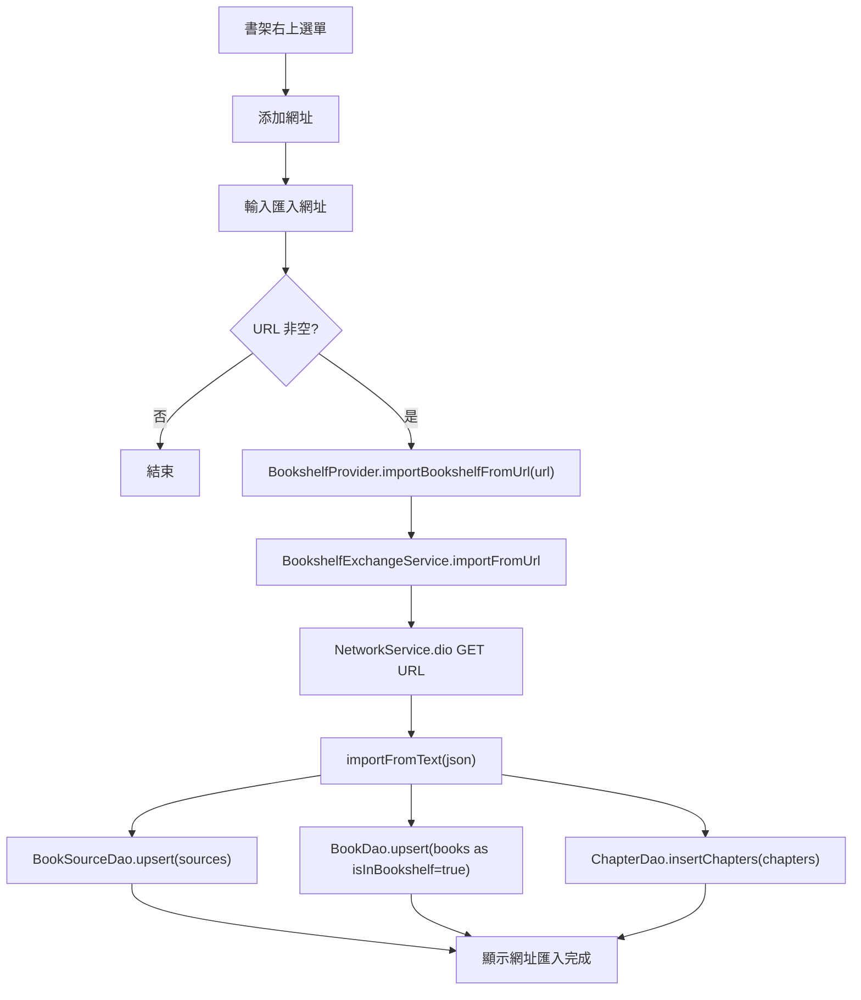

### B4. 書架搜尋入口

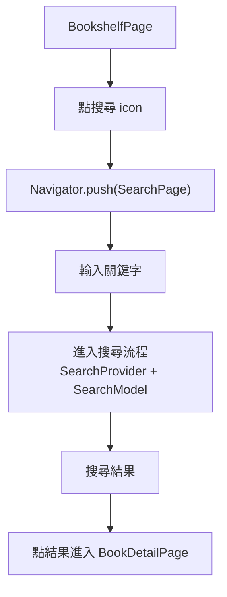

### B5. 書架切換列表 / 網格

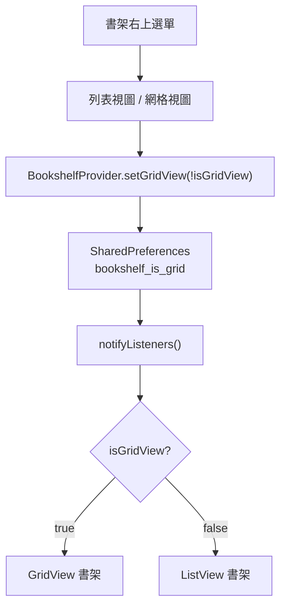

### B6. 書架多選、移入分組、刪除、全選

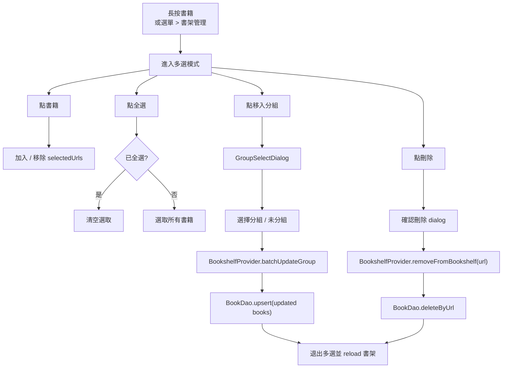

### B7. 書架分組管理

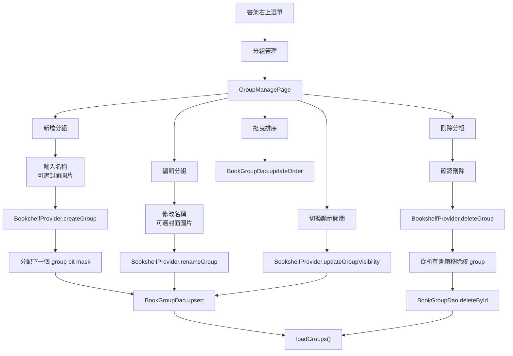

### B8. 匯入書架

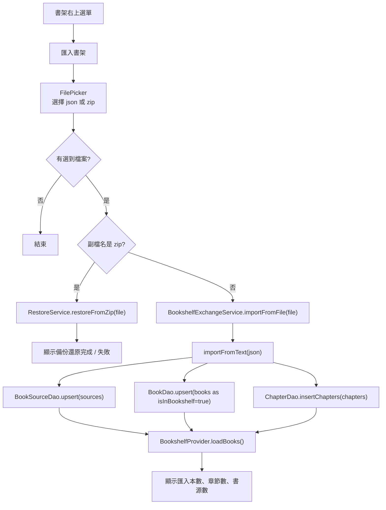

### B9. 匯出書架

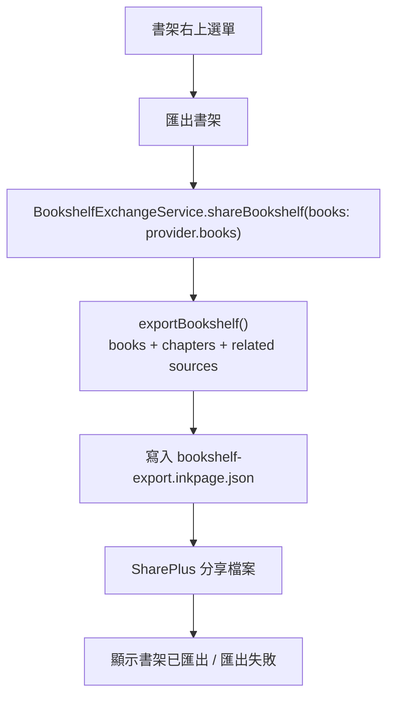

## B 類流程摘要

| 編號 | 使用者動作 | 主要入口 | 系統主要動作 |
| --- | --- | --- | --- |
| B1 | 點書架上的書 | `BookshelfPage._openBook` | 開啟 `ReaderPage` 並用 `ReaderOpenTarget.resume(book)` 恢復進度 |
| B2 | 添加本地 | `importLocalBookPath` | 解析本地檔、保存 book / chapters、刷新書架 |
| B3 | 添加網址 | `importBookshelfFromUrl` | 從 URL 下載書架 JSON，匯入 books / chapters / sources |
| B4 | 書架搜尋 | `SearchPage` | 進入搜尋流程 |
| B5 | 切換列表 / 網格 | `setGridView` | 寫入 `SharedPreferences` 並重建書架 |
| B6 | 多選管理 | 多選 app bar actions | 選取、全選、移入分組、刪除 |
| B7 | 分組管理 | `GroupManagePage` | 新增、改名、顯示/隱藏、排序、刪除分組 |
| B8 | 匯入書架 | `BookshelfExchangeService` / `RestoreService` | 匯入 json 或還原 zip |
| B9 | 匯出書架 | `BookshelfExchangeService.shareBookshelf` | 產生 JSON 並呼叫系統分享 |
