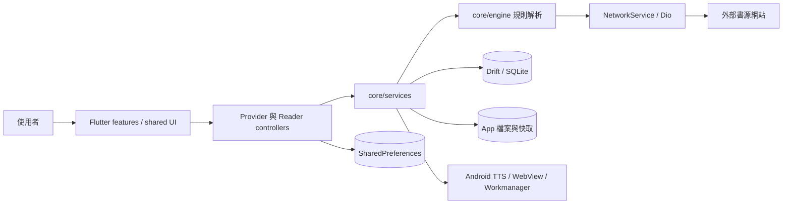

# 夜讀 Night Reader — 系統架構

夜讀是一個以 Flutter 實作的 Android 閱讀器。App 本身擁有 UI、規則解析、閱讀排版與所有持久狀態；網路書源網站只在執行時提供搜尋、目錄與正文，專案沒有自有後端服務。

## 系統概觀

`lib/main.dart` 是程序入口，先建立 Flutter binding、錯誤處理與原生 splash，再由 `configureDependencies()` 註冊資料庫、DAO、網路與服務。`ReaderApp` 建立全域 Provider 與 Material app，`MainPage` 提供書架、發現與個人設定三個主要入口。

## 關鍵流程

### 書源搜尋與取文

功能頁的 Provider 呼叫書源服務；`WebBook` 與規則引擎解析書源規則，所有 HTTP 請求經 `NetworkService` 的 Dio 與攔截器送往外部網站。搜尋結果、書籍、章節、Cookie 與執行狀態依用途寫入 Drift、檔案快取或記憶體。

需要登入或互動驗證的流程可使用 WebView。批次書源校驗走專用 isolate 並關閉互動式 WebView，以免背景工作要求 UI。

### 閱讀

`BookOpenRoute` 建立 Reader V2 頁面，`ReaderV2Runtime` 管理開書、跳章、樣式切換與錯誤狀態。章節 repository 依序使用本機內容、持久快取或書源網路取得正文，再套用替換規則與繁簡轉換。

Hybrid reader 把內容切成可排程的 block，但同一來源段落的延續 block 會合併成一個 `ui.Paragraph` 排版。`DocumentIndex` 保存可見文件幾何，`ReaderV2Location` 以章節、字元位移與視覺位移作為跨層位置契約；進度最後由 `BookDao` 落盤。

### 背景工作

Workmanager 的 `callbackDispatcher()` 在另一個 isolate 執行，會重新呼叫 `configureDependencies()`，再讀取書架並執行背景任務。任何新增背景路徑都必須假設 DI 與記憶體單例不會跨 isolate 共用。

## 資料與狀態歸屬

| 狀態 | 真相來源 | 主要入口 |
|---|---|---|
| 書籍、書源、章節、書籤、下載、Cookie | Drift / SQLite | `lib/core/database/` 與各 DAO |
| 正文、封面、度量與其他檔案快取 | App 私有檔案系統 | `lib/core/storage/`、Reader content storage |
| 使用者偏好與主題模式 | `SharedPreferences` | `PreferKey`、`SettingsProvider`、`ThemeSettingsProvider` |
| Reader 即時會話與可見位置 | 記憶體 | `ReaderV2Runtime`、viewport、`ReaderV2Location` |
| 書源規則與解析結果 | 書源資料 + 記憶體／持久快取 | `core/engine`、`WebBook`、書源服務 |

資料表或 DAO 變更需要同步 Drift 生成碼與 schema migration。影響 Model 或 Reader 預設值的偏好設定需要同步 `SettingsProvider`、`AppConfig` 與 `PreferKey`。

## 外部系統

- 書源網站：提供搜尋、詳情、目錄與正文，格式、登入、反爬與可用性不受 App 控制。
- Android WebView：處理互動登入或驗證流程。
- Android TTS 與媒體服務：提供朗讀、語音選擇與媒體通知。
- Android Workmanager：執行背景書架任務。
- GitHub Actions：建置並發布簽章 APK。

## 部署

目前發布目標是 Android `arm64-v8a`。`.github/workflows/android-release.yml` 在 `v*` tag 時建置簽章 APK 並發布 GitHub Release；手動 `workflow_dispatch` 只建置測試 artifact。標準發布順序與檢查以根目錄 `AGENTS.md` 為準。

模組責任與修改入口請從 [Codebase Atlas](night_reader_index.md) 進入。
